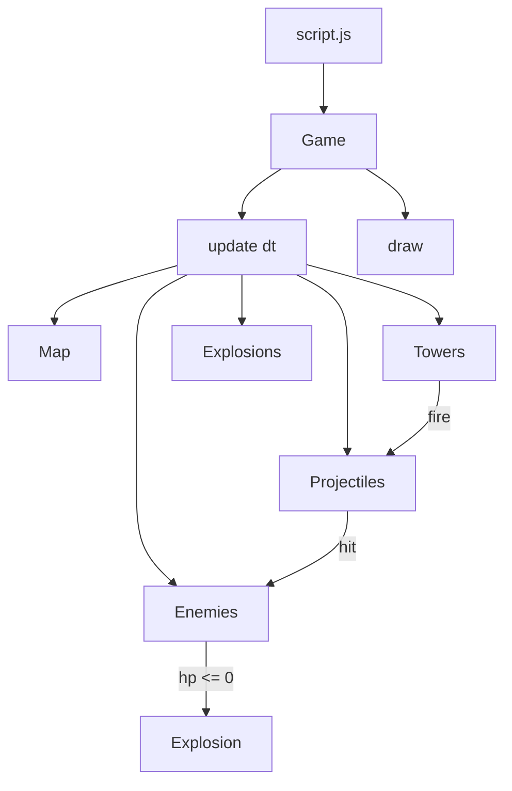

# Tower Defence MVP (HTML + Canvas)

## Текущее состояние

- В репозитории **нет** `index.html` / JS — только ассеты Kenney в [`assets/PNG/Retina/`](assets/PNG/Retina/).
- Взрыв: **`explosionSmoke1.png` … `explosionSmoke5.png`** (кадры разного размера: 120×120, 114×112, 126×126, 92×90, 106×104 — см. [`assets/Spritesheet/onlyObjects_retina.xml`](assets/Spritesheet/onlyObjects_retina.xml)).
- Тайлы Retina: **128×128** в исходниках; на canvas рисуем с **`TILE_SIZE = 64`** (масштаб через `drawImage`).

## Структура файлов (как вы просили)

| Файл | Роль |
|------|------|
| [`index.html`](index.html) | `<canvas id="game">`, HUD (золото, жизни, волна), два `<script>` |
| [`style.css`](style.css) | Центрирование, фон, HUD поверх/рядом с canvas |
| [`script.js`](script.js) | `DOMContentLoaded` → `new Game('game')` |
| [`game.js`](game.js) | Все классы и константы уровня (без ES modules — глобальные классы) |

Анти-паттерн соблюдаем: логика только в `game.js`, разметка/CSS отдельно.

## Архитектура (классы в `game.js`)



### `Game`
- Поля: `canvas`, `ctx`, `images` (словарь после preload), `enemies`, `towers`, `projectiles`, `explosions`, `gold`, `lives`, `wave`, `lastTime`.
- **`loadAssets()`** — Promise на массив путей; после загрузки — `startWave()` / первый спавн.
- **`loop(timestamp)`** — `requestAnimationFrame`, `dt` в секундах, `update(dt)` → `draw()` → снова rAF.
- **`spawnExplosion(x, y)`** — `this.explosions.push(new Explosion(x, y, this.images))`.
- **Ввод**: клик по canvas → попытка поставить башню (если клетка не дорога и хватает золота).
- **Фильтрация**: в конце `update` удалять `explosions` с `finished`, мёртвых `enemies`, попавшие `projectiles`.

### `Explosion` (анимация 5 спрайтов)
- Конструктор: `(x, y, images)` — массив/ссылки на `explosionSmoke1`…`5`.
- `frameIndex` (0–4), `frameTime` накопитель, **`FRAME_DURATION ≈ 0.08` с** (≈400 ms на весь взрыв).
- **`update(dt)`**: при превышении порога — `frameIndex++`; если `frameIndex >= 5` → `finished = true`.
- **`draw(ctx)`**: текущий кадр **по центру** `(x, y)`:

```js
const img = this.frames[this.frameIndex];
const w = img.width * scale; // scale = TILE_SIZE / 128
const h = img.height * scale;
ctx.drawImage(img, this.x - w / 2, this.y - h / 2, w, h);
```

### `Enemy`
- Спрайт: [`tank_red.png`](assets/PNG/Retina/tank_red.png).
- Движение по **`PATH_WAYPOINTS`** (массив `{col, row}` → пиксели в центре клетки); `progress` между точками, `speed` px/s.
- `hp`, `maxHp` (полоска HP опционально — простой rect).
- При `hp <= 0`: `game.spawnExplosion(x, y)`, начислить gold, `alive = false`.
- Дошёл до конца пути → `game.lives--`, удалить врага.

### `Tower`
- Спрайт: [`tank_green.png`](assets/PNG/Retina/tank_green.png) (башня = зелёный танк).
- Параметры: `range`, `damage`, `fireCooldown`, `cost` (например 50 gold).
- **`update`**: найти ближайшего живого врага в радиусе; если `cooldown <= 0` — создать `Projectile` и сбросить cooldown.
- **`draw`**: спрайт + полупрозрачный круг радиуса при hover/выборе (опционально, только если клетка под курсором — можно пропустить в MVP).

### `Projectile`
- Спрайт: [`bulletGreen1.png`](assets/PNG/Retina/bulletGreen1.png).
- Летит к цели (`target` ref); при дистанции &lt; hitRadius — `target.takeDamage(damage)`, `hit = true`.
- Если цель умерла раньше — снять снаряд.

### Карта и путь (минимальный уровень)
- Константа **`GRID_COLS × GRID_ROWS`** (например **16×10** → canvas **1024×640**).
- **`LEVEL_TILES`**: 2D-массив ключей спрайтов (`'tileGrass1'`, `'tileGrass_roadEast'`, `'tileGrass_roadNorth'`, углы `'tileGrass_roadCornerUL'` и т.д.) — **один зигзагообразный путь** слева направо/вниз, остальное — трава.
- **`PATH_WAYPOINTS`**: упорядоченный список клеток дороги (центры для движения врагов) — вручную, 8–12 точек, без автогенерации тайлов.
- **`isRoad(col, row)`** — по `LEVEL_TILES` или отдельному Set; башню нельзя ставить на дорогу.

Отрисовка карты в `Game.drawMap()`: двойной цикл по сетке, `drawImage` с масштабом `TILE_SIZE/128`.

## Preload (минимальный набор ассетов)

```
assets/PNG/Retina/
  tileGrass1.png
  tileGrass_roadEast.png, tileGrass_roadNorth.png
  tileGrass_roadCornerUL.png, tileGrass_roadCornerLR.png (по форме пути)
  tank_red.png, tank_green.png
  bulletGreen1.png
  explosionSmoke1.png … explosionSmoke5.png
```

Пути относительные от корня сайта → нужен **локальный HTTP-сервер** (`npx serve .` или Live Server), иначе `file://` может блокировать загрузку картинок.

## Игровой цикл (MVP-баланс)

| Параметр | Значение (стартовые) |
|----------|----------------------|
| Стартовое золото | 100 |
| Жизни | 10 |
| Стоимость башни | 50 |
| Волна | каждые 2.5 s спавн врага с начала пути, макс. 8 за волну |
| HP врага | 30, speed 80 px/s |
| Башня | range 120px, damage 10, cooldown 0.6s |

HUD в `index.html` обновляется из `Game` (`textContent` для gold/lives/wave).

## Порядок отрисовки (`draw`)

1. Карта (тайлы)
2. Башни
3. Враги (+ HP bars)
4. Снаряды
5. Взрывы (поверх всего)
6. UI подсказка при нехватке золота (опционально, canvas text)

## [`script.js`](script.js)

```js
window.addEventListener('DOMContentLoaded', () => {
  new Game('game');
});
```

## [`index.html`](index.html) (скелет)

- `<link rel="stylesheet" href="style.css">`
- `<div id="hud">` — Gold / Lives / Wave
- `<canvas id="game" width="1024" height="640">`
- `<script src="game.js"></script>` затем `<script src="script.js"></script>`

## Проверка после реализации

1. Запустить сервер из корня репозитория.
2. Открыть страницу — карта и HUD видны.
3. Клик по траве → появляется зелёная башня, золото уменьшается.
4. Красные танки идут по дороге; башня стреляет.
5. При смерти врага — **5-кадровый дымовой взрыв** по центру, затем исчезает.
6. Враг дошёл до конца — минус жизнь.

## Что сознательно не входит в MVP (следующие шаги)

- Несколько типов башен / апгрейды
- Волны с UI «Start wave»
- Звук, спрайтлисты вместо отдельных PNG
- Вынос классов в отдельные файлы (когда `game.js` вырастет)
